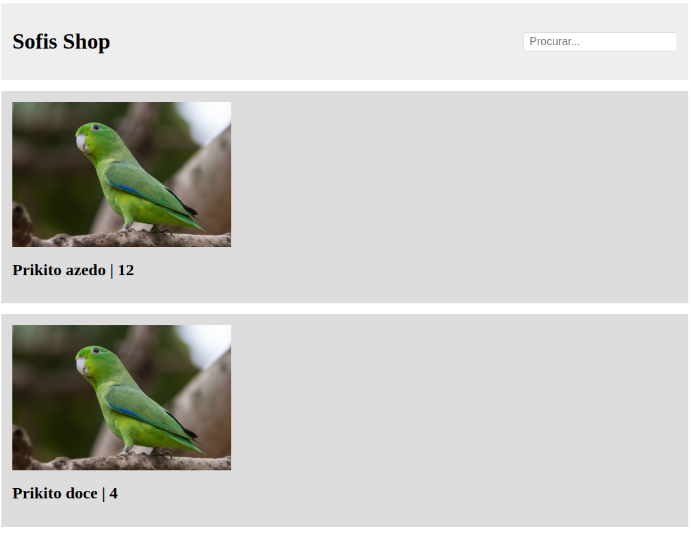

# Kitto

Front-end framework de javascript (uau!!). Objetivo: ser tão simples ao ponto de ser inviável de usar em qualquer projeto. O nome faz uma referência a minha gata que se chama Kit.

## Como começar

```html
<!-- ./src/index.html -->
<html>
	<head><title>Kitto!</title><head>
	<body>
		<div id="root"></div>
		<script src="../dist/index.js"></script>
		<script src="../dist/app.js"></script>
	</body>
</html>
```

```ts
const root: HTMLElement | null = document.getElementById("root");
if (!root) throw new Error("Root is not present on the DOM");

interface ICard {
  name: string
}

const card = ({ name }: ICard) => {
  let count = 0;

  return view((el) => div({
    children:
    [
      img({
	src: "https://i.pinimg.com/736x/99/30/a2/9930a2286fe7a6daa7f39f7de6f38166.jpg",
	style: "max-height: 100%; width: 20rem",
	onclick: () => {count++; el.refresh();}
      }),
      h2({ textContent: `${name} | ${count}` })
    ],
    style: "padding: 1rem; background-color: #ddd"
  })
)
}

const header = div({
  children: div({
    children: [
      h1({
	textContent: "Sofis Shop",
	style: "font-size: 2rem; color: black; font-weight: 600",
      }),
      input({ placeholder: "Procurar...", onblur: () => alert("oi"), style: "padding: 0.25rem 0.5rem; border: 1px solid #ddd; border-radius: 0.25rem; font-size: 1rem;",  })
    ],
    style: "display: flex; align-items: center; justify-content: space-between",
  }),
  style: "padding: 1rem; background-color: #eee",
});

const el = main({
  children: [
    header,
    div({
      children:
      [
	card({ name: "Prikito azedo" }),
	card({ name: "Prikito doce" }),
      ],
      style: "display: grid; gap: 1rem;"
    })
  ],
  style: "display: grid; gap: 1rem;"
})

root.appendChild(el);
```

## Resultado

