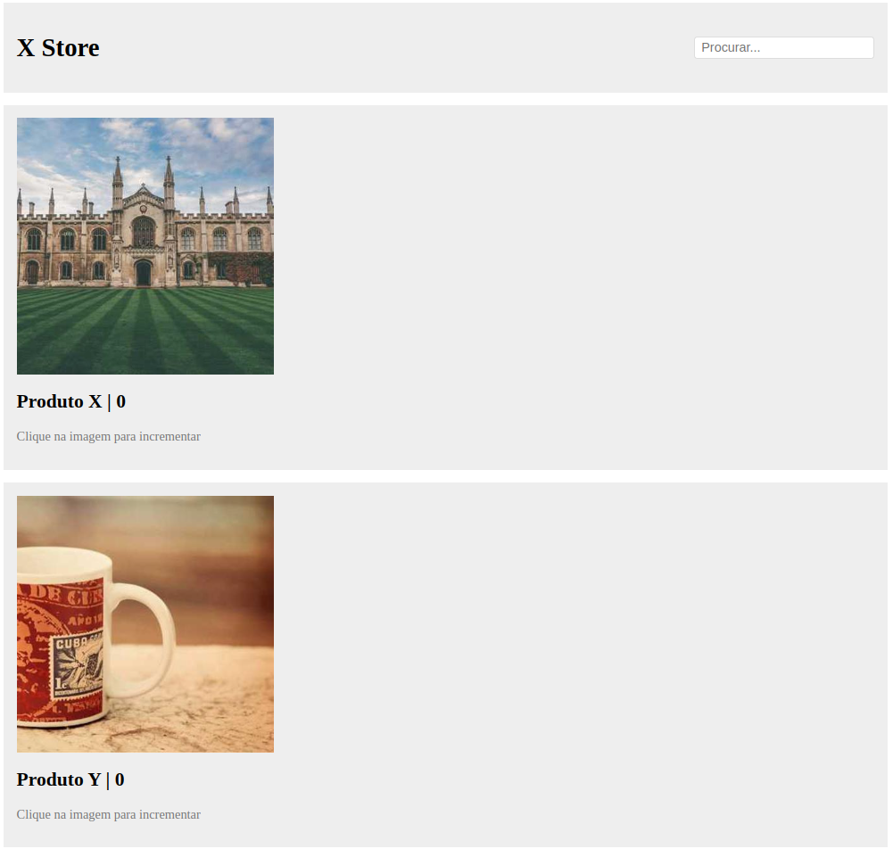

# Kitto

Front-end framework de javascript (uau!!). Objetivo: ser tão simples ao ponto de ser inviável de usar em qualquer projeto. O nome faz uma referência a minha gata que se chama Kit.

## Como começar

Clone o repositório, entre no diretório do projeto:
```
git clone https://github.com/leolace/kitto.git
cd kitto/
```

Instale as dependências e compile o typescript para gerar arquivos .js dentro de `dist/`
```
npm install
tsc
```

Inicie um servidor local dentro de `src/`:
```
cd src/
python3 -m http.server 3000
```

Em seu navegador, navegue até `http://localhost:3000`.

```html
<!-- ./src/index.html -->
<html>
  <head><title>Kitto!</title><head>
  <body>
    <div id="root"></div>
    <script src="../dist/index.js"></script>
    <script src="../dist/app.js"></script>
  </body>
</html>
```

```ts
const root: HTMLElement | null = document.getElementById("root");
if (!root) throw new Error("Root is not present on the DOM");

interface ICard {
  name: string
  imageSrc: string
}

const card = ({ name, imageSrc }: ICard) => {
  let count = 0;

  return view(({ refresh }) => div({
    children:
    [
      img({
	src: imageSrc,
	style: "max-height: 100%; width: 20rem",
	onclick: () => {count++; refresh();}
      }),
      h2({ textContent: `${name} | ${count}` }),
      p({ textContent: "Clique na imagem para incrementar", style: "color: #777" })
    ],
    style: "padding: 1rem; background-color: #eee"
  })
)
}

const header = div({
  children: div({
    children: [
      h1({
	textContent: "X Store",
	style: "font-size: 2rem; color: black; font-weight: 600",
      }),
      input({ placeholder: "Procurar...", onblur: () => alert("oi"), style: "padding: 0.25rem 0.5rem; border: 1px solid #ddd; border-radius: 0.25rem; font-size: 1rem;",  })
    ],
    style: "display: flex; align-items: center; justify-content: space-between",
  }),
  style: "padding: 1rem; background-color: #eee",
});

const el = main({
  children: [
    header,
    div({
      children:
      [card({ name: "Produto X", imageSrc: "https://picsum.photos/500" }), card({ name: "Produto Y", imageSrc: "https://picsum.photos/400" })],
      style: "display: grid; gap: 1rem;"
    })
  ],
  style: "display: grid; gap: 1rem;"
})

root.appendChild(el);
```

## Resultado

